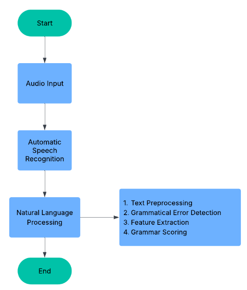

# 🎙️ Grammar Scoring Engine for Voice Samples

This project builds an end-to-end pipeline that takes an audio voice sample (spoken English), converts it to text using automatic speech recognition (ASR), and evaluates the grammatical correctness of the transcribed text using a transformer-based grammar scoring model.

---

## 📌 Problem Statement

**Input**: Audio file of a person speaking English.  
**Output**: A grammar score (scale: 1 to 5) representing how grammatically correct the spoken text is.

---

## 🚀 Project Workflow

The complete pipeline includes the following stages:

1. **Audio Input**  
   User uploads an audio file in `.mp3`, `.wav`, or `.m4a` format.

2. **Automatic Speech Recognition (ASR)**  
   Using the `openai/whisper` model to convert speech to text.

3. **Natural Language Processing (NLP)**  
   Using `textattack/roberta-base-CoLA`, a RoBERTa model trained on the CoLA (Corpus of Linguistic Acceptability) dataset to assess grammar acceptability.

4. **Scoring**  
   The model outputs a probability of acceptability which is scaled to a 1–5 grammar score.

5. **Text-to-Speech (TTS)** *(Optional)*  
   Converts corrected or sample text back to speech using Google Text-to-Speech (`gTTS`).

---

## 🧠 Technologies & Models Used

| Component | Model/Library |
|----------|----------------|
| ASR | [`openai/whisper`](https://github.com/openai/whisper) |
| Grammar Scoring | [`textattack/roberta-base-CoLA`](https://huggingface.co/textattack/roberta-base-CoLA) |
| TTS | [`gTTS`](https://pypi.org/project/gTTS/) |
| Libraries | `transformers`, `whisper`, `torchaudio`, `torch`, `numpy`, `IPython` |

---

## 🖼️ Project Architecture



---

## 🔧 Setup Instructions

### Google Colab (Recommended)
The notebook is best executed in **Google Colab**, where internet access is allowed to install required packages like `whisper`.


Link to Colab: [Grammar_Scoring_Engine](https://colab.research.google.com/drive/10uqAzc0KVCZz-JxftDk7NQrflmdNvFIg?usp=sharing)


### Install Dependencies
```bash
!pip install -q transformers
!pip install -q openai-whisper
!pip install -q torchaudio
!pip install -q git+https://github.com/openai/whisper.git
!pip install -q pydub
!pip install -q gTTS
